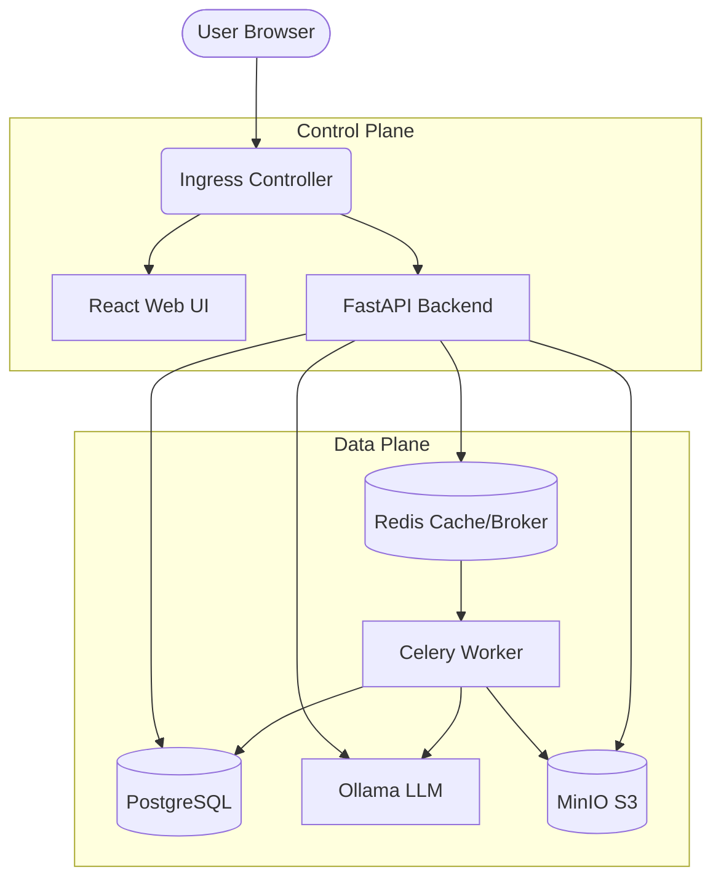

# LocalMind: Secure On-Premise Legal AI Copilot

LocalMind is a fully air-gapped, Retrieval-Augmented Generation (RAG) system tailored specifically for the legal sector. It allows law firms to securely upload, query, and synthesize highly sensitive corporate documents (such as M&A contracts and case files) using local LLMs. 

Built to comply with strict data localization laws (like India's DPDP Act), LocalMind ensures that zero client data is ever transmitted to public APIs like OpenAI or Anthropic.

## 🚀 Features

- **100% On-Premise Execution:** Local inference via Ollama (`llama3.2:3b` and `nomic-embed-text`) ensures complete data sovereignty.
- **Enterprise-Grade Infrastructure:** Containerized microservices orchestrated via Kubernetes (or Docker Compose for local testing).
- **Multi-Tenant Isolation:** NetworkPolicies and namespaced storage buckets ensure strict separation of tenant data.
- **Robust Ingestion Pipeline:** Asynchronous Celery workers handle heavy document parsing, chunking, and embedding.
- **Semantic Caching:** Redis-backed semantic caching accelerates response times and reduces GPU load.
- **Modern UI:** React frontend with streaming text (Server-Sent Events) and expandable citation sources.

## 🏗️ Architecture



## 🛠️ Tech Stack

- **Backend:** Python, FastAPI, Celery, SQLAlchemy, FAISS
- **Frontend:** React, TypeScript, Vite, Tailwind CSS, Lucide Icons
- **Infrastructure:** Kubernetes, Helm, Docker, Postgres, Redis, MinIO
- **AI/ML:** Ollama, Llama 3.2 (3B), Nomic-Embed-Text

## 📦 Installation & Setup

LocalMind supports both a lightweight local development setup via Docker Compose and an enterprise deployment via Kubernetes/Helm.

### Option 1: Docker Compose (Local Testing)
1. Clone the repository: `git clone https://github.com/Rishi-2115/Localmind.git`
2. Run `docker-compose up -d --build`
3. Access the application at `http://localhost:3000`

### Option 2: Kubernetes (Production Deployment)
1. Ensure you have a running Kubernetes cluster (e.g., Minikube, K3d, or bare-metal).
2. Install the Helm chart:
   ```bash
   helm install localmind-release ./infra/helm/localmind
   ```
3. Wait for all pods to reach a `Running` state:
   ```bash
   kubectl get pods -w
   ```
4. Port-forward the frontend and backend:
   ```bash
   kubectl port-forward deployment/localmind-release-web 8080:3000
   kubectl port-forward deployment/localmind-release-api 8000:8000
   ```
5. Access the application at `http://localhost:8080`

## 🔐 Security & Privacy

- **Data Locality:** All models are downloaded and run locally on your cluster's hardware.
- **Dynamic Credential Rotation:** Secrets (e.g., MinIO and Postgres passwords) are securely auto-generated and persisted across Helm upgrades using `randAlphaNum`.
- **Zero-Trust Networking:** `NetworkPolicy` objects restrict pod-to-pod communication on a strict need-to-know basis (e.g., web pods cannot directly query Postgres).
- **Encrypted Ingress:** TLS termination is supported via Cert-Manager.

## 👥 Contributors

- Rishi Shukla (Founder & Lead Developer)

## 📄 License
All rights reserved.
